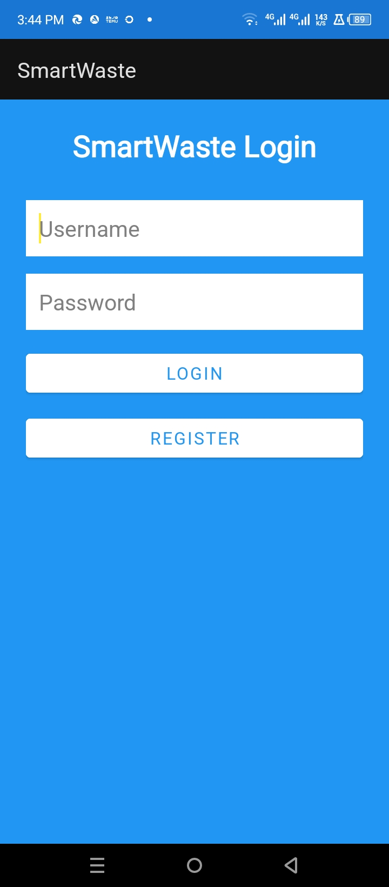
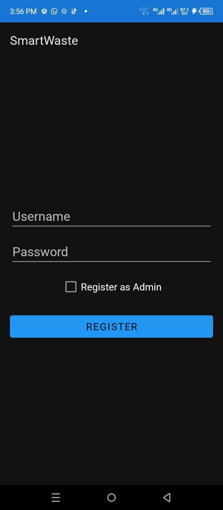
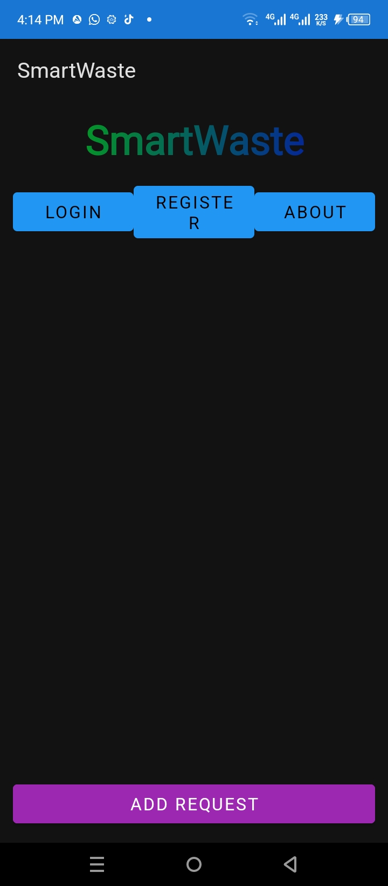
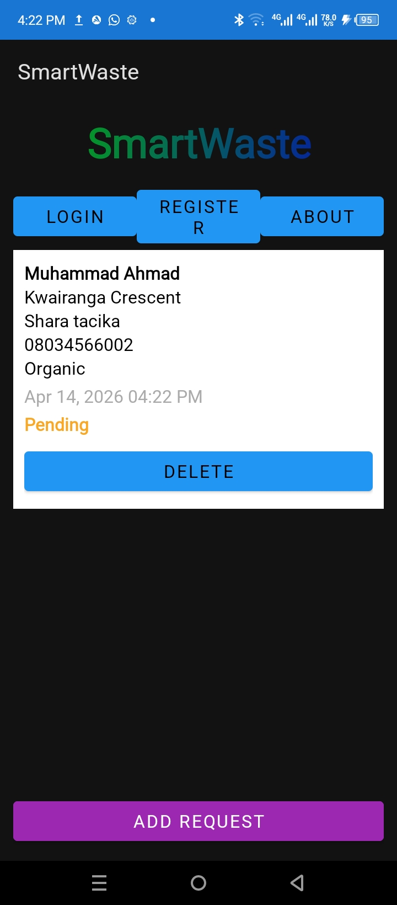
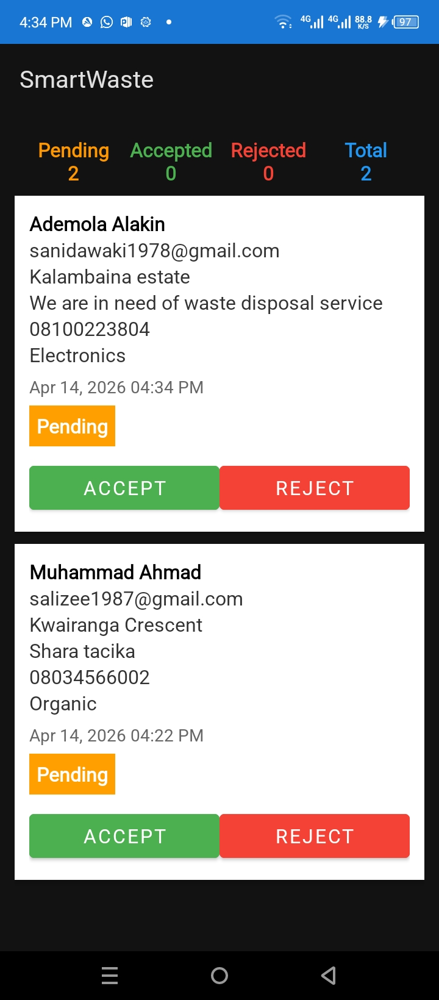
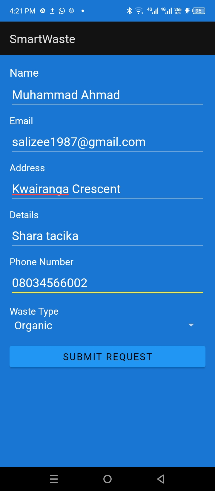
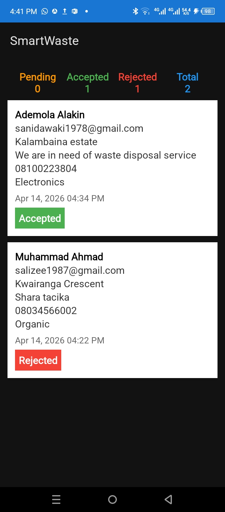
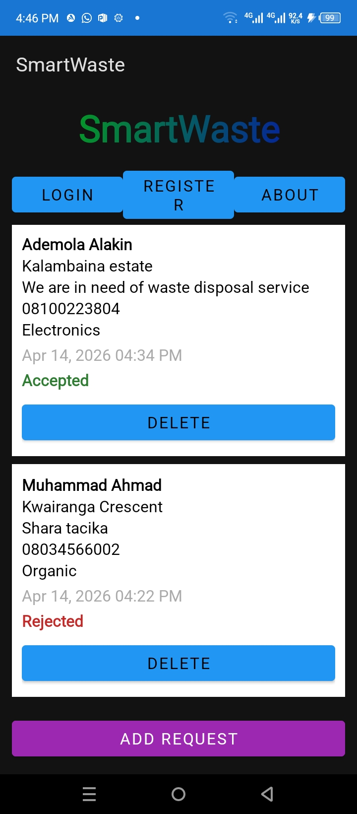

# ♻️ Smart Waste Management System (Android App)

## 📱 Overview

The **Smart Waste Management System** is an Android application designed to improve waste collection and disposal processes through digital solutions. The app enables users to request waste pickup, report waste issues, and promote cleaner, more sustainable communities.

This project demonstrates **Java-based Android development**, focusing on user interaction, data management, and efficient service delivery using local storage (SQLite/Room) without external backend services.

---

## 🎯 Objectives

- Improve waste management efficiency  
- Enable easy reporting of waste issues  
- Support user interaction with waste collection services  
- Promote environmental sustainability  

---

## 🚀 Features

- 🔐 User Registration & Login System  
- 🏠 Home Page Interface  
- 👤 User Dashboard  
- 🛠️ Admin Dashboard  
- 📝 Waste Request Submission  
- ⚙️ Request Processing System  
- 📊 Local Database Storage (SQLite/Room)  
- 📱 Clean and responsive UI  

---

## 🛠️ Technologies Used

- **Java** (Core Android Development)  
- **Android Studio** (IDE)  
- **XML** (UI Design)  
- **SQLite / Room Database** (Local Storage)  

---

## 📂 Project Structure

SmartWasteManagement/
│── app/
│ ├── java/com/example/smartwaste/
│ ├── res/layout/
│ ├── res/values/
│── gradle/
│── build.gradle
│── settings.gradle


---

## ⚙️ Installation Guide

### 1. Clone Repository

```bash
git clone https://github.com/salizee/SmartWasteManagement.git

2. Open Project
Open Android Studio
Click Open Project
Select the cloned folder
3. Run App
Connect emulator or Android device
Click ▶ Run


## 📸 App Screenshots

### 🔐 Login Page


---

### 📝 Registration Page


---

### 🏠 Home Page


---

### 👤 User Dashboard


---

### 🛠️ Admin Dashboard


---

### 📝 Request Page


---

### ⚙️ Request Processing


---

### 🎯 Final Page



📌 Future Improvements
Firebase / cloud database integration
Real-time waste tracking system
GPS-based pickup optimization
Push notifications
Web-based admin dashboard
🤝 Contribution

Contributions are welcome. Feel free to fork this repository and submit a pull request.

📄 License

This project is for academic and educational purposes.

👨‍💻 Author

Salisu M. Indabawa
ICT Student | Data Scientist | Android Developer

📧 Email: salisuindabawa@gmail.com

📍 Nigeria

🌍 Impact

This project contributes to:

Cleaner environments
Smart city development
Digital transformation of waste management systems

⭐ If you find this project useful, please give it a star on GitHub!
